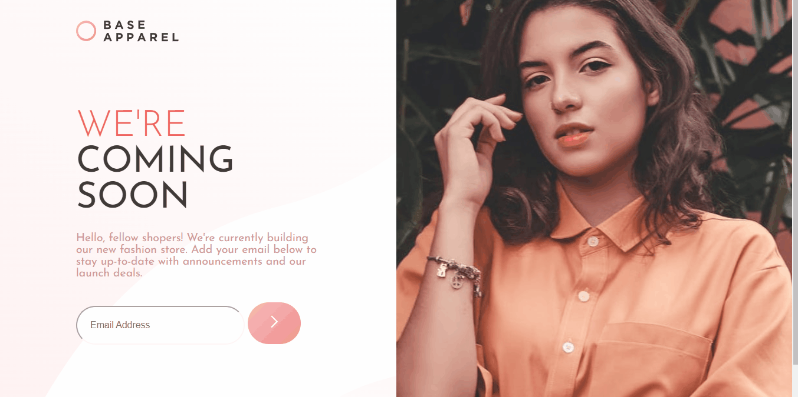

# Desafio Coming Soon - Frontend-Mentor

Este é um desafio de uma página de FAQ proposto pelo site Frontend-Mentor.

## Tabela de Conteúdos

- [Visão Geral](#visão-geral)
    - [Imagens](#imagens)
    - [Link da página](#link)
- [Processo](#processo)
    - [Linguagens utilizadas](#linguagens-utilizadas)
    - [O que aprendi](#o-que-aprendi)
    - [Possíveis evoluções](#possíveis-evoluções)
- [Autor](#autor)

## Visão-geral

### Imagens

<br>

````
Versão de Desktop
````

   

<br>

````
Versão Mobile
````

 

### Link

- Página no GitHub Pages: <a href="https://julio-mansan2.github.io/base-apparel-coming-soon/">Clique aqui!</a>

## Processo

### Linguagens utilizadas

<br>

- Marcações semânticas de HTML5
- Propriedades de customização do CSS3
- Estruturas de JavaScript

<br>

### O que aprendi

<br>

- Ocultar imagens não semânticas, em caso de erro:

````html


````

- Validar um input e-mail:

````html

<form>
    <input type="email" required  maxlength="60" size='65' class="borda-normal" name="" id="email" placeholder="Email Address">
    <button id="submit" type="submit">
        
    </button>
</form>

<span class="error-message">Please, provide a valid email</span>
````
````javascript

inputSubmit.addEventListener ('click', () =>   
{
    event.preventDefault()
    if ((inputText.value === "" || inputText.validity.valid === false)) {            
        inputText.classList.remove("borda-normal")
        inputText.classList.add("borda-vermelha")
        errorMessage.classList.add("aparecer")
        errorIcon.classList.add("aparecer")
    } else {
        inputText.classList.remove("borda-vermelha")
        errorMessage.classList.remove("aparecer")
        errorIcon.classList.remove("aparecer")
    }
})


````
<br>

### Possíveis evoluções

<br>

- Códigos mais compactos;
- Posicionar melhor os elementos, utilizando assim, menos medições manuais;
- Colocar o input submit sobreposto ao input email, de forma que fique visualmente agradável.

<br>

## Autor

GitHub - <a href="https://github.com/julio-mansan2">julio-mansan2</a> <br>
Front-end Mentor - <a href="https://www.frontendmentor.io/profile/julio-mansan2">julio-mansan2</a> <br>
LinkedIn - <a href="https://www.linkedin.com/in/j%C3%BAlio-a-mansan-3415a7249/">Júlio A.</a> <br>